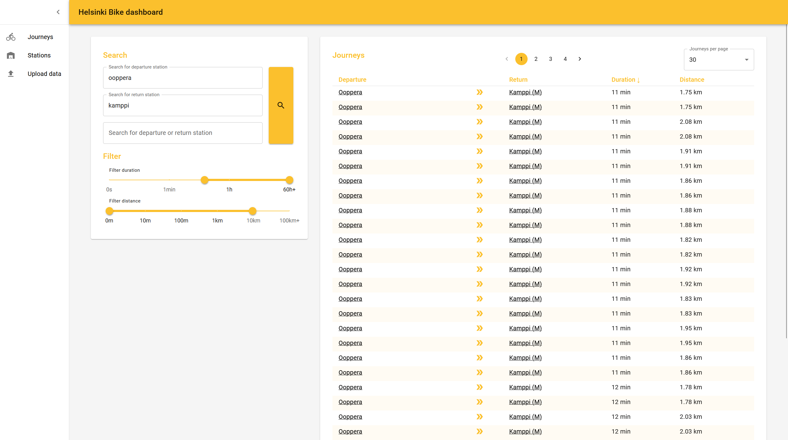
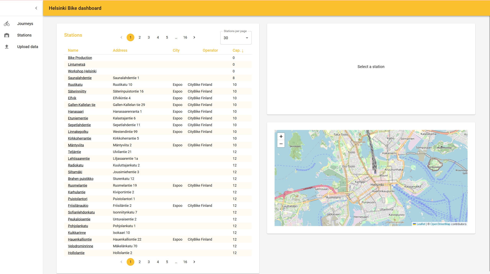
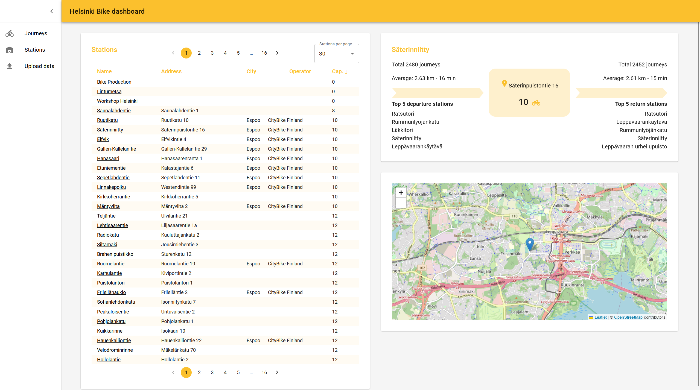
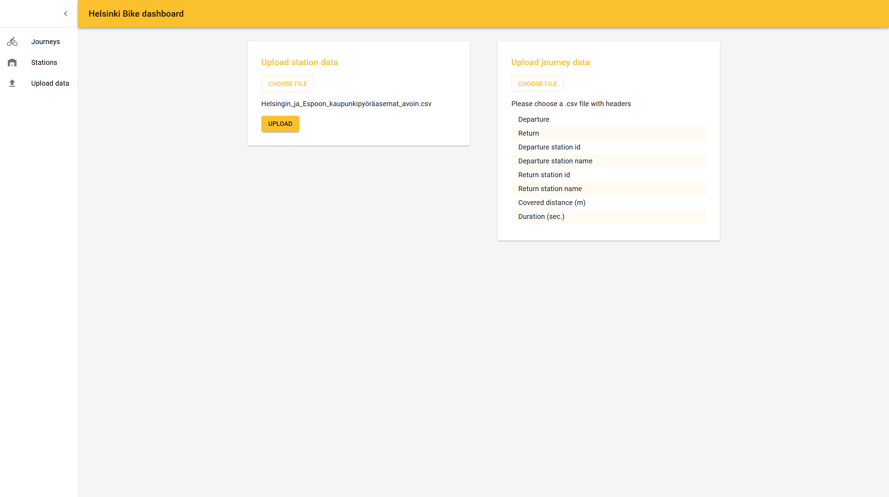

# Solita Dev Academy assignment

The application is developed with a Java Spring Boot backend and React frontend. The chosen database technology is MySQL.

## Instructions

The backend is a maven project and can be run with:

`./mvnw spring-boot:run` from the `backend` directory

It will serve the built React frontend from `/backend/src/main/resources/static`

The React frontend can also be started separately in development mode (requires Node.js and npm) with:

`npm install` then `npm start` from the `frontend` directory

The backend runs on port 8080 and the frontend on port 3000.

### Database

Set up a MySQL database somewhere and configure its connection in `/backend/src/main/resources/application.properties`
. The current application.properties is set up for a local MySQL database running on port 3306 with user root and 
password password. You only need to create
a database `bikeapp` on the database, spring boot will do the rest. After running the Spring Boot server for the first
time `spring.jpa.hibernate.ddl-auto` in `application.properties` can be changed to "none" to not recreate the database
next time. Assuming the same database, it can be filled from the dump file with
`mysql -h localhost -P 3306 -u root -p bikeapp  < dump.sql`
## Data import

Data can be uploaded through the webapp. There is a separate upload for station and journey data. Data must be in .csv 
format, and it must have the same headers as the provided .csv files. Maximum file size is 200MB. Uploading a 100MB file
locally takes over an hour so the dump file in the repository should be used to fill the database.
There are indexes on the journey table to significantly speed up the journey list page.

## Journey list

The journey list with the recommended parts and pagination, ordering per column, searching by station names and filtering
by duration and distance. Due to the indexes, sorting by columns is very fast even with all of the data. Doing any
searching or filtering slows it down noticeably. Clicking a station takes you to that stations page.

-- there is no loading indicator so it is not clear whether searching finished.

## Station list

Lists all the stations with pagination and ordering by column. Clicking a station goes to that stations page.

## Single station

All of the recommended and additional parts except for filtering by month. Using leaflet and OSM to show the station on the map.

## Upload

Upload station or journey data. Checks if the file is in the correct format and has the correct headers.

## Other notes
Overall I focused on writing good code and implementing features thoroughly and completing them. I think I spent too much
time on the assignment but I also found it interesting and a good learning opportunity. It is the first webapp I have
made from 0 to deployment. I used the MUI react library to make styling easy and consistent.

